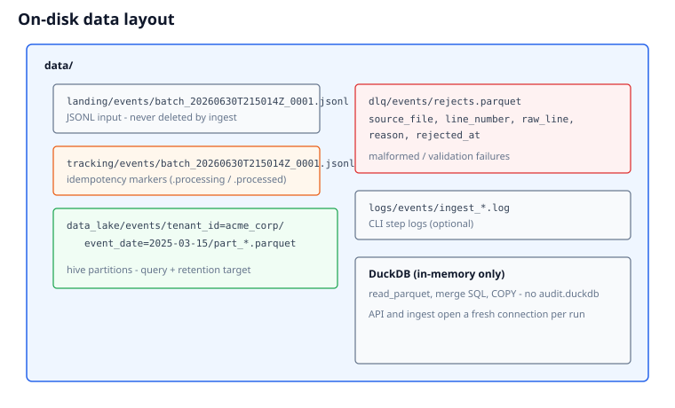
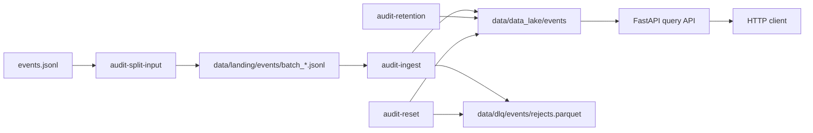
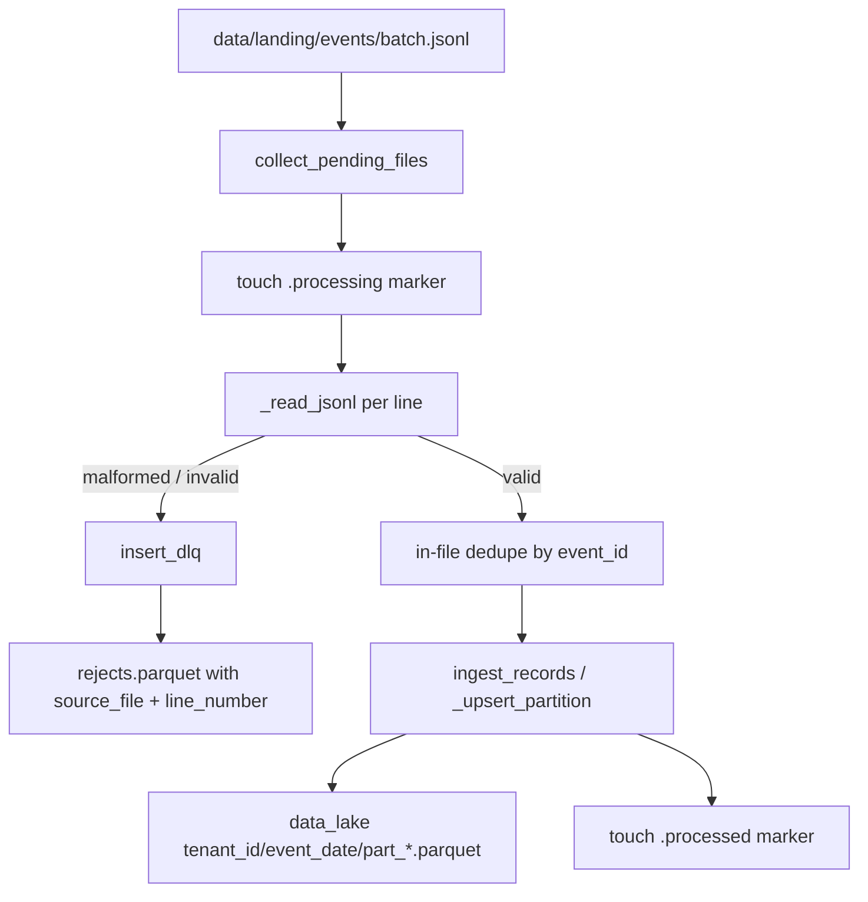

# Architecture

This document describes **how the service is built**. For **why** (decisions, trade-offs, exercise mapping), see [DESIGN.md](DESIGN.md). For setup and CLI usage, see [README.md](README.md).

## Diagrams

| | |
|---|---|
| **System overview** — CLIs, data lake, API, DLQ |  |
| **Ingest flow** — per-file validation, DLQ, partition upsert |  |
| **On-disk layout** — landing, tracking, lake, DLQ |  |

## Exercise scope

The Cloudsmith take-home asks for four capabilities. This architecture implements each as a distinct path:

| # | Capability | Component | Entry point |
|---|------------|-----------|-------------|
| 1 | Ingest JSONL, handle bad data & duplicates | `processing/ingestion/` | `audit-ingest events` |
| 2 | Tenant-isolated storage | `EventsTable` + Hive partitions | `data/data_lake/events/tenant_id=*/` |
| 3 | Filtered query API | `api/app.py` | `GET /tenants/{tenant_id}/events` |
| 4 | Retention cleanup | `processing/retention/` | `audit-retention events` |

Optional prep and ops CLIs:

| | Component | Entry point |
|---|-----------|-------------|
| Split source into landing batches | `processing/ingestion/split_input.py` | `audit-split-input events events.jsonl` |
| Wipe lake + DLQ + markers | `processing/reset/reset.py` | `audit-reset events -y` |



---

## Overview

The service separates **write path** (CLI ingest / retention / reset) from **read path** (HTTP API). All durable event data lives in **hive-partitioned Parquet** on disk. **DuckDB** is used as an ephemeral in-memory SQL engine to read, merge, and write Parquet — there is no persistent DuckDB database file.

---

## Components

| Layer | Location | Responsibility |
|-------|----------|----------------|
| **API** | `api/app.py` | Tenant-scoped HTTP queries; no ingest on startup |
| **Processing — ingest** | `processing/ingestion/ingest.py` | JSONL → validate → dedupe → Parquet upsert |
| **Processing — split** | `processing/ingestion/split_input.py` | Source JSONL → numbered landing batches |
| **Processing — reset** | `processing/reset/reset.py` | Wipe data lake, DLQ, tracking markers; optional landing |
| **Processing — retention** | `processing/retention/retention.py` | Delete expired partitions |
| **Storage** | `models/events/table.py` (`EventsTable`) | Parquet partition read/write/merge, DLQ append |
| **Models** | `models/events/` | `EventRecord`, query params, response DTOs |
| **Config** | `config/app.config`, `config/{pipeline}.config` | Paths and operational knobs |
| **SQL engine** | `db/client.py` (`DuckDBClient`) | In-memory DuckDB for `read_parquet` / `COPY` |

---

## Ingest data flow



Per rejected line, DLQ stores:

| Column | Source |
|--------|--------|
| `source_file` | Landing JSONL filename (e.g. `batch_20260630T215014Z_0003.jsonl`) |
| `line_number` | 1-based line index in that file |
| `raw_line` | Original text |
| `reason` | `malformed_json` or Pydantic validation message |
| `rejected_at` | UTC timestamp when ingest rejected the row |

---

## Query data flow

```
GET /tenants/{tenant_id}/events?filters...
        │
        ▼
EventQueryParams (Pydantic validation)
        │
        ▼
EventsTable.list_events()
        │
        ▼
read_parquet('data/data_lake/events/tenant_id={id}/**/*.parquet',
             hive_partitioning=true)
        │
        ▼
WHERE tenant_id = ? AND optional filters
ORDER BY timestamp LIMIT/OFFSET
        │
        ▼
EventsResponse { events, total, limit, offset }
```

Tenant isolation is enforced by:

1. **Path pruning** — only reads under `tenant_id={tenant_id}/`
2. **SQL filter** — `WHERE tenant_id = ?`
3. **API** — `tenant_id` required in URL path

---

## Parquet partitioning

| Partition key | Source |
|---------------|--------|
| `tenant_id` | `EventRecord.tenant_id` |
| `event_date` | `EventRecord.timestamp.date()` (UTC, stored as DATE) |

Tenant is the top-level folder so the API never reads across customers. Date is the second level so time-range filters and retention can skip whole directories.

On-disk layout (Hive-style):

```
data/data_lake/events/
  tenant_id=acme_corp/
    event_date=2025-03-15/
      part_<uuid>.parquet
```

Ingest only rewrites partitions present in the batch — usually today's `event_date=` for each tenant, not every day on disk. Each rewrite may produce one or more `part_*.parquet` files under that folder.

More detail: [DESIGN.md §2](DESIGN.md#2-partition-merge--tenant_id--event_date-keys).

---

## Tracking markers

Ingest idempotency uses marker files in `data/tracking/{pipeline}/`:

| Marker | Meaning |
|--------|---------|
| `file.jsonl.processing` | Ingest in progress (logged + visible in `inventory_* .processing`) |
| `file.jsonl.processed` | Successfully ingested; counted in `inventory_* .processed` |

Files without either marker are **pending**. After a split, many batches start as pending; each `audit-ingest` run processes up to `ingest_batch_size` files until `ingest_complete` is true.

Input JSONL files are **never deleted** — only markers are added.

---

## Configuration resolution

```
CLI argument: events
        │
        ├─▶ config/events.config     → ingest_batch_size, retention_days
        │
        └─▶ config/app.config        → base paths
                │
                ├─ data/landing/events/
                ├─ data/tracking/events/
                ├─ data/data_lake/events/
                └─ data/dlq/events/
```

Pipeline name is always taken from the CLI argument (or defaults to `events`), not from a `name` field inside the TOML file.

---

## Extension points

| To add… | Where |
|---------|-------|
| New event type / pipeline | New `EventsTable`-like class + registry in `db/tables.py` + `config/{name}.config` |
| New query filters | `EventQueryParams` + `EventsTable._build_event_filters` |
| New validation rules | `EventRecord` Pydantic validators |
| Compaction / file-size limits | Post-process hook after `_upsert_partition` |
| DLQ replay | Read `rejects.parquet` by `source_file` + `line_number`, fix payload, re-ingest |

See [DESIGN.md](DESIGN.md) for rationale behind these choices.

